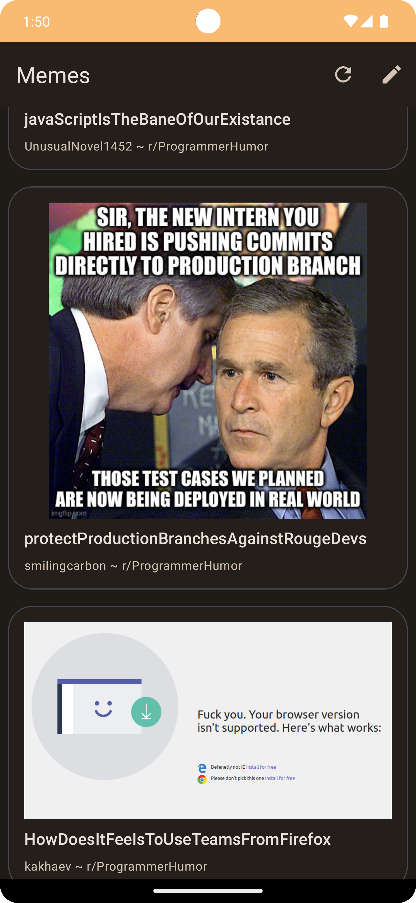
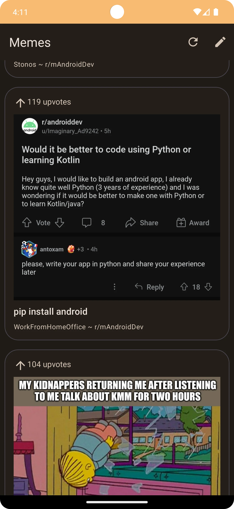

# Memes

Scrapes memes from subreddits and provides an elegant way to view them.

## Screenshots

# Features
- Choose custom subreddits to scrape from
- Provides an elegant way to view them
- Material You themed
- Long click to download
- Single tap to view in browser
- Smooth image loading with Glide
- Quick loading
- Upvote counter
- Dark mode
- Smooth performance
- No limits on number of memes
- No ads
- No tracking
- No analytics

Utilizes [Meme API](https://github.com/D3vd/Meme_Api) for fetching memes.

Please note that some subreddits may not be accessible due to Reddit's API limitations.
